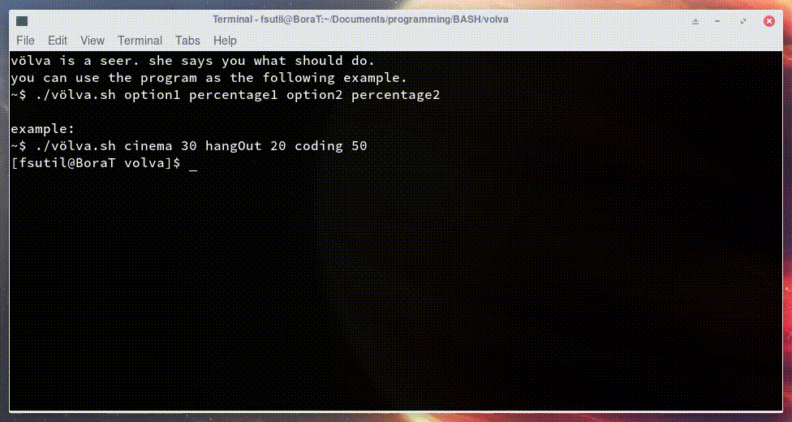

völva is a seer. she says you what should do.  
you can use the program as the following example.  

```bash
	~$ ./völva.sh option1 percentage1 option2 percentage2
```  

**example:**
```bash
	~$ ./völva.sh cinema 30 hangOut 20 coding 50
```

<p align="center"> 
	</a>
</p>